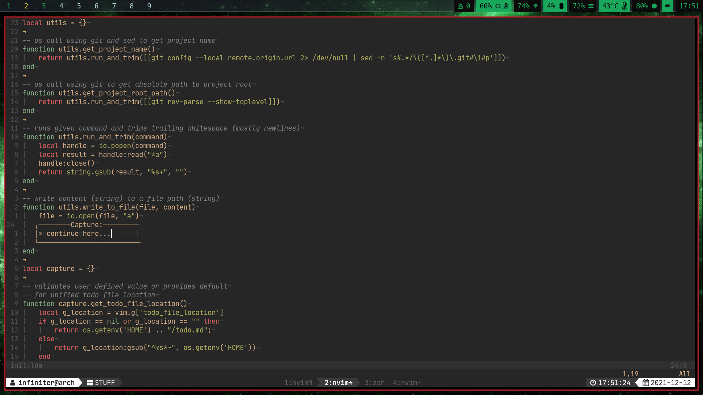
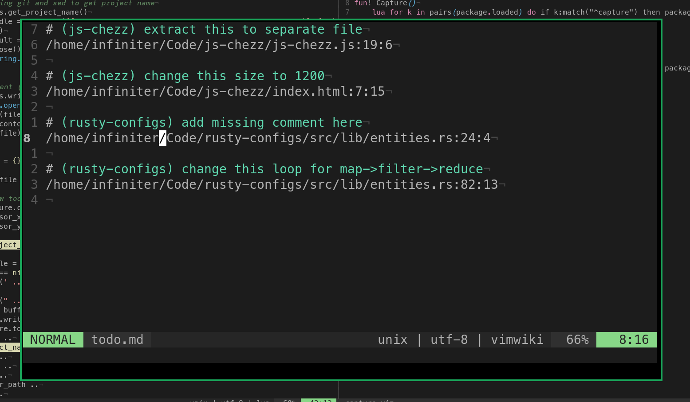

# capture-nvim

plugin to quickly store ideas with exact place in a file

## Installation
```
Plug 'nagy135/capture-nvim'
```
Optionally for fancy gui prompt
```
Plug 'MunifTanjim/nui.nvim'
```

## Usage



+ leader X - create new todo
+ leader J - jump to file (improved gF that jumps to column as well as line)

both binds have "shift modifier" ... so, leader, shift+x

## Configuration

Put these lines in your `init.lua` or inside [lua block](https://github.com/nanotee/nvim-lua-guide#using-lua-from-vimscript) in `.vimrc`.
```
require("capture").setup({
    location = "~/todo.md",
    project_root_todo = false
})
```

### location
Combined place to store captures.

### project_root_todo
Controls behavior where `todo.md` is stored in root of git repository/

### Change binds
Simply define binds you want with provided lua functions
```
nnoremap <leader>X :lua capture_module.create_todo()<CR>
nnoremap <leader>J :lua capture_module.jump_to_file_with_column()<CR>
```

## Similair projects
I am using this plugin for my own personal use and I like its minimal nature.
For more features and more "emacs capture" feel, you might wanna try [orgmode.nvim](https://github.com/kristijanhusak/orgmode.nvim)

## TODO
+ check if inside git repository (now nvim crashes instead)
+ make higher level headers in combined root todo list
